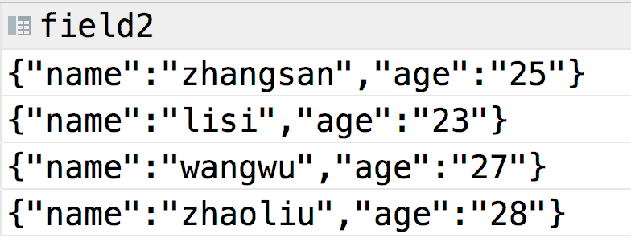
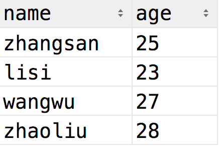
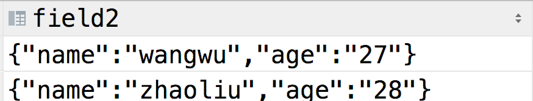

>hive支持struct,map,array三种集合类型

### struct
与**C语言**、**golang**中的struct类似,可以通过`.`语法来访问

定义一个包含struct字段的表
```text
create table test2(field1 struct<name:string,age:int> comment "test field") row format delimited fields terminated by "," collection items terminated by ":";
```

其中`row format delimited fields terminated by ","`表示字段之间用","分割
`collection items terminated by ":";` 字段中各个元素项之间用":"分割

然后导入数据,可以使用sql语句和文件的方式,首先是sql语句
```text
insert into test2(field1)values(named_struct("name",'zhangsan',"age",25));
insert into test2(field1)values(named_struct("name","lisi","age",23));
```

从文件导入,新建一个test.txt,内容如下
```text
name:wangwu|age:27
name:zhaoliu|age:28
```

使用`load data`语句从本地导入
```text
load data local inpath '/Users/zhangsheng/hive/note/hive/test.txt' into table test2;
```

使用`.`语法查询数据
```text
-- 查询所有数据
select * from test2;
-- 查询name字段
select field1.name from test2;
-- 查询name为zhangsan的记录
select field1 from test2 where field1.name = "zhangsan";
```

结果如下


### map
同struct,**map**的用法基本相似,以下为创建一个map类型字段
```text
create table test3(field2 map<string,string>) row format delimited fields terminated by ',' collection items terminated by "|" map keys terminated by ":";
```
map keys terminated by ":"表示键值对之间用":"来分割

同样的,先使用sql方式插入
```text
insert into test3(field2)values(str_to_map("name:zhangsan,age:25")),(str_to_map("name:lisi,age:23"));
```

再导入文件,文件内容如下:
```text
load data local inpath  '/Users/zhangsheng/hive/note/hive/test.txt' into table test3;
```

map的访问通过`map[key]`的形式进行,测试一下
```text
select * from test3;
select field2["name"] as name,field2["age"] as age from test3;
select * from test3 where field2["age"] > 25;
```

结果如下




### array
与所有支持数组的编程语言一致,使用`array[下标]`的方式访问,创建一个**array**类型字段
```text
create table test4(field4 array<string>);
```

插入数据
```text
insert into test4(field4)values(array("zhangsan","lisi","wangwu"));
insert into test4(field4)values(`array`("lily","bob","alice"));
insert into test4(field4)values(`array`("A","B","C"));
```

查询测试
```text
select * from test4;
select field4[0] from test4;
select * from test4 where field4[0]="zhangsan";
```

结果如下


