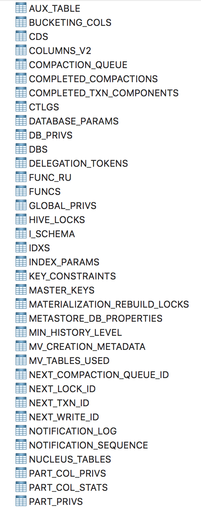

> hive默认的元数据库为derby,除了derby外,hive也可以设置元数据库为mysql

### 系统环境
| 操作平台 | macOS X 10.13.2 64位 | 
| :------: | :------: |
| hadoop版本 | 3.1.2 | 
| hive版本 | 3.1.1 |
| mysql版本| 5.6.30 |
|mysql所在平台|centOS 6.5|
|jdk版本|1.8.0|
|jdbc版本|mysql-connector-java-8.0.16.jar|

### 软件安装
**hadoop**与**hive**采用 **brewhome**安装
```shell
brew install hadoop
brew install hive
```
**mysql**很早前通过源码编译安装的,网上有绿色版可以直接下载使用.
**jdk**傻瓜式安装过程.

### 环境变量配置
```sh
# java config
export MAVEN_HOME=/usr/local/mvn/
export JAVA_HOME=/Library/Java/JavaVirtualMachines/jdk1.8.0_151.jdk/Contents/Home
export CLASSPATH=$JAVA_HOME/lib
export PATH=$PATH:$JAVA_HOME/bin

# hadoop config
export HADOOP_HOME=/usr/local/Cellar/hadoop/3.1.2/libexec
export HADOOP_ROOT_LOGGER=ALL,Console
export HADOOP_COMMON_HOME=$HADOOP_HOME
export PATH=$PATH:HADOOP_HOME/bin


# hive config
export HIVE_HOME=/usr/local/Cellar/hive/3.1.1/libexec
export PATH=$PATH:$HIVE_HOME/bin
```

### 配置

1. 创建一个hive用的数据库与数据库账号(可以直接用root),如果是远程数据库的话,需要修改`mysql.user`表,修改`Host`字段为hive机器所在ip,简单点直接改为`*`即可
2. 下载`jdbc`包,放置到`$HIVE_HOME/lib`下
3. 配置hive,相关配置点在后端
4. 初始化数据库,启动hive服务

创建`hive_sit.xml`
```sh
cd $HIVE_HOME/conf
cp hive-default.xml.template hive_site.xml
vim hive_sit.xml
```
输入如下结构,具体信息请自行修改

```xml
<?xml version="1.0" encoding="UTF-8" standalone="no"?>
<?xml-stylesheet type="text/xsl" href="configuration.xsl"?>
<configuration>
    <property>
        <name>javax.jdo.option.ConnectionURL</name>
        <value>jdbc:mysql://数据库:端口/数据库名称</value>
    </property>
    <property>
        <name>javax.jdo.option.ConnectionDriverName</name>
        <value>com.mysql.cj.jdbc.Driver</value>
    </property>
    <property>
        <name>javax.jdo.option.ConnectionUserName</name>
        <value>用户名</value>
    </property>
    <property>
        <name>javax.jdo.option.ConnectionPassword</name>
        <value>密码</value>
    </property>
</configuration>
```

修改`hive_env.sh`,设置`HADOOP_HOME`,`HIVE_CONF_DIR`,`HIVE_AUX_JARS_PATH`三项

```sh
HADOOP_HOME=/usr/local/Cellar/hadoop/3.1.2/libexec
export HIVE_CONF_DIR=/usr/local/Cellar/hive/3.1.1/libexec/conf
export HIVE_AUX_JARS_PATH=/usr/local/Cellar/hive/3.1.1/libexec/lib
```

初始化hive的元数据库
```sh
schematool -dbType mysql -initSchema
```
初始化后数据库中会有如下表:

启动hive
```sh
hive --service metastore &
```

测试,输入`hive`并回撤进入**hive**命令行状态
```sh
hive> show databases;
OK
default
Time taken: 0.123 seconds, Fetched: 1 row(s)
```
如果返回以上结果,表示配置完毕
