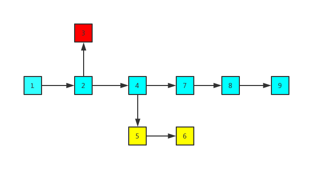
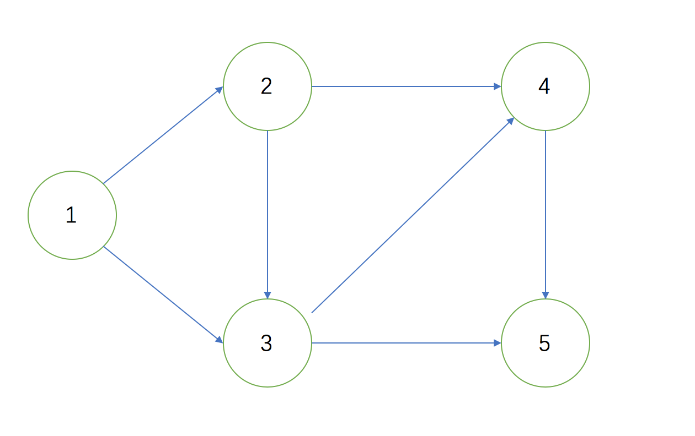
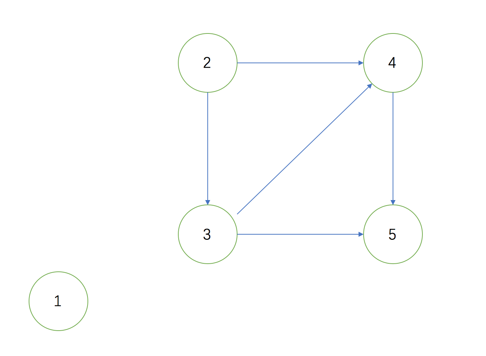
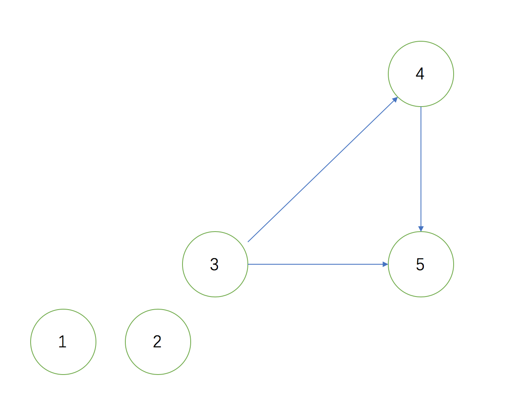
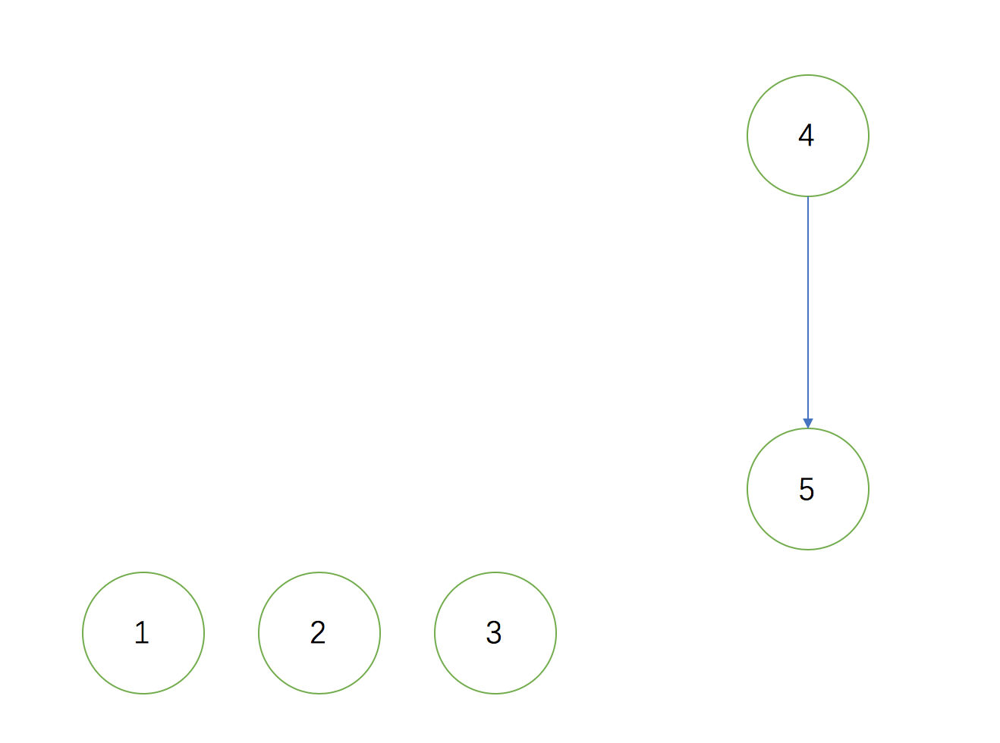
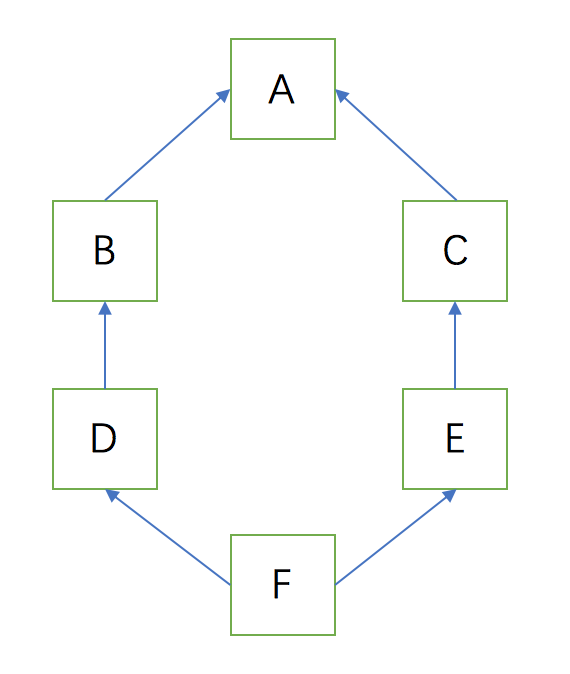

>类在继承自多个父类的时候,调用父类的方法时,如果多个父类均存在对应方法,那么确定调用那个哪一个将十分困难.

## MRO算法
**python**中使用`MRO`算法来确定方法解析顺序,`MRO`即**Method Resolution Order**

`MRO`依赖于`C3算法`,而`C3算法`的结果则与`拓扑排序`类似

`拓扑排序`需要一个满足条件的`DAG`, 而`DAG`又是在区块链序列结构上的变形

下面将一一介绍相关点

### 区块链序列
每个**block**像铁链一样,环环相扣,其中最长的(蓝色)链条就是最长链,后续**block**后继续扩充这个链条,蓝色和黄色的支链最终会被抛弃.


### 有向无环图
有向无环图,即**Directed Acyclic Graph**,简称为**DAG**,**DAG**与区块链结构类似,不同点在于**DAG**结构中每一个**block**不仅仅只加入最长链,还会加入前面所有的**block**,通俗点理解,就是不仅连接父节点,还会连接祖父节点.


把这个DAG换一种方式表示


### 拓扑排序
由一个有向无环图的顶点组成的序列,当且仅当满足下列条件时,称为该图的一个拓扑排序,即**Topological sorting**
>1. 每个顶点出现且只出现一次 
>2. 若A在序列中排在B的前面,则在图中不存在从B到A的路径.

拓扑排序指的是每次找到一个只指向别人的点(学术性说法:入度为0),记录下来,然后忽略掉这个点和它所指出去的线,再找到下一个只指向别人的点,记录下来,直到剩最后一个点,所有记录的点的顺序就是拓扑顺序

上述的**DAG**图就是一个拓扑排序,顶点1,2,3,4,5只出现一次,4在5前面,不存在从5到4的箭头(其他同理)

下面来分解排序步骤,先找到一个只指向别人的点(点1),忽略点1和他支出的线

再找到只指向别人的点2,忽略线

接下来是点3

最终的顺序就是1,2,3,4,5


### C3算法
**MRO**排序应用了**C3**算法,**C3**算法的结果类似与拓扑排序,先确定一个线性序列,然后查找路径由由序列中类的顺序决定

```python
class A: pass
class B(A):pass
class C(A):pass
class D(B):pass
class E(C):pass
class F(D,E):pass
```

结构图如下


计算某一个点的拓扑序列的算法为`mro(Child (Base1,Base2)) = [Child] + merge(mro(Base1), mro(Base2), [Base1,Base2] )`
* 其中`Child`为要计算序列的节点,
* `Base1,Base2`表示`Child`继承的父节点
* `mro(Base1),mro(Base2)` 表示`Base1,Base2`的拓扑序列
* `[Base1,Base2]`表示`Child`继承的父节点列表

根据上述公式,要计算F点的拓扑序列
```
mro(F(D,E)) = [F] + merge(mro(D),mro(E),[D,E])


mro(D(B)) = [D] + merge(mro(B),[B])
mro(B(A)) = [B] + merge(mro(A),[A])
mro(A) = [A]

mro(D(B)) = [D] + merge([B], [B] + merge(mro(A),[A]),[B])
mro(D(B)) = [D] + merge([B], [B] + merge([A],[A]),[B])
mro(D(B)) = [D] + merge([B],[B,A],[B])

mro(D) = [D,B,A]
mro(E) = [E,C,A]

mro(F(D,E)) = [F] + merge([D,B,A],[E,C,A],[D,E])
mro(F) = [F,D,B,E,C,A]
```
merge操作就是C3算法的核心,遍历执行merge操作的序列,如果一个序列的第一个元素,在其他序列中也是第一个元素,或不在其他序列出现,则从所有执行merge操作序列中删除这个元素,合并到当前的mro中,merge操作后的序列,继续执行merge操作,直到merge操作的序列为空

```
mro(F) = [F] + merge([D,B,A],[E,C,A],[D,E])
D是序列中第一个元素,且在第三个序列中也是第一个元素,删除D合并到[F]
mro(F) = [F,D] + merge([B,A],[E,C,A],[E])
B不存在于其他序列中,删除B
mro(F) = [F,D,B] + merge([A],[E,C,A],[E])
E是序列中第一个元素,且不在第三个序列中个是第一个元素,删除E
mro(F) = [F,D,B,E] + merge([A],[C,A])
C是不存在于其他序列,删除C
mro(F) = [F,D,B,E,C] + merge([A],[A])
A在序列中是第一个元素,在其他序列中也是第一个元素删除A
mro(F) = [F,D,B,E,C,A]
```

利用`__mro__`属性查看下查找顺序与与结果是否一致
```python
class A: pass
class B(A): pass
class C(A): pass
class D(B): pass
class E(C): pass
class F(D, E): pass

print("D的查找顺序", D.__mro__)
print("E的查找顺序", E.__mro__)
print("F的查找顺序", F.__mro__)
```

* D的查找顺序 (<class '__main__.D'>, <class '__main__.B'>, <class '__main__.A'>, <class 'object'>)
* E的查找顺序 (<class '__main__.E'>, <class '__main__.C'>, <class '__main__.A'>, <class 'object'>)
* F的查找顺序 (<class '__main__.F'>, <class '__main__.D'>, <class '__main__.B'>, <class '__main__.E'>, <class '__main__.C'>, <class '__main__.A'>, <class 'object'>)


### 算法实现

来看一段c3算法及merge算法
```python
def mro(classname):
    if classname:
        try:
            if len(classname.__bases__) == 1:
                # 如果只有一个 说明没有继承其他类,只继承了object,直接返回即可
                return [classname, classname.__bases__[0]]
            else:
                # 如果继承了多个类 递归计算每个类的mro序列在合并
                # mro(Child (Base1,Base2)) = [Child] + merge(mro(Base1), mro(Base2), [Base1,Base2] )
                # merge(mro(Base1), mro(Base2))
                l = [mro(base) for base in classname.__bases__]
                # [Base1,Base2]
                l.append([base for base in classname.__bases__])
                #    child + merge(mro(Base1), mro(Base2), [Base1,Base2])
                return [classname] + merge(l)

        except AttributeError as err:
            print(err)
    else:
        return TypeError("需要非None参数")


# 遍历执行merge操作的序列,如果一个序列的第一个元素,在其他序列中也是第一个元素,
# 或不在其他序列出现,则从所有执行merge操作序列中删除这个元素,
# 合并到当前的mro中,merge操作后的序列,继续执行merge操作,直到merge操作的序列为空
def merge(args):
    if args:
        for l in args:
            for clsName in l:
                for otherList in args:
                    # 如果在其他列表中存在([1:]表示非第一个元素) 不满足删除条件 break
                    # 不执行清除操作
                    if clsName in otherList[1:]:
                        break
                else:
                    # 如果在其他列表中(非第一个元素)不存在 这个元素清除
                    merge_list = []
                    # 遍历总序列中列表
                    for clsNameList in args:
                        # 查找要移除的元素是否在每一个列表中
                        if clsName in clsNameList:
                            # 如果在 就删除这个元素
                            clsNameList.remove(clsName)
                            # 移除元素后这个列表如果不为空
                            if clsNameList:
                                # 把这个列表加入下一次merge操作
                                merge_list.append(clsNameList)
                        else:
                            merge_list.append(clsNameList)
                    # 返回移除后的元素 + 继续执行merge(剩余列表)
                    return [clsName] + merge(merge_list)
        else:
            raise Exception
    else:
        return []
```

来分析一下算法计算F的`mro`算法,公式为`mro(F(D,E)) = [F] + merge(mro(D),mro(E),[D,E])`

首先 `mro[A],mro[B],mro[C],mro[D],mro[E]` 都满足 `len(classname.__bases__) == 1` 直接返回,不需要merge

```
mro(A) = [A,object]
mro(B) = [B,A,object]
mro(D) = [D,B,A,object]

mro(C) = [C,A,object]
mro(E) = [E,C,A,object]
```
**注: `object`为所有`python`对象的基类**

为了便于理解,简化一下步骤
```
mro(F) = [F] + merge([D,B,A,object],[E,C,A,object],[D,E])
```
### 循环步骤
1. 开始循环第一个元素`D`,查看`D`是否在其他列表中(去除第一个元素),伪代码:
```
if D in [B,A,object],[C,A,object],[E]
不在,执行else分支,从所有list中删除D,剩余序列为
[B,A,object],[E,C,A,object],[E],返回D,对剩余序列继续进行merge
return [D] + merge([B,A,object],[E,C,A,object],[E])
```
2. 循环元素`B`,查看`B`是否在其他列表中(去除第一个元素),伪代码:
```
if B in [A,object],[C,A,object],[]
不在,执行else分支,从所有list中删除B,剩余序列为
[A,object],[E,C,A,object],[E],返回B,对剩余序列继续进行merge
return [D] + [B] + merge([A,object],[E,C,A,object],[E])
```
3. 循环元素`A`,查看`A`是否在其他列表中(去除第一个元素),伪代码:
```
if A in [object],[C,A,object],[]
在break
```
4. 循环元素`object`,同`A`,break
5. 循环元素`E`,同`B`,`return [D]+[B]+[E]+merge([A,object],[C,A,object])`
6. 循环元素`C`,同`E`,`return [D]+[B]+[E]+[C]+merge([A,object],[A,object])`
7. 循环元素`A`,同`C`
8. 循环元素`object`,同`A`
最终结果 F,D,B,E,C,A,object
